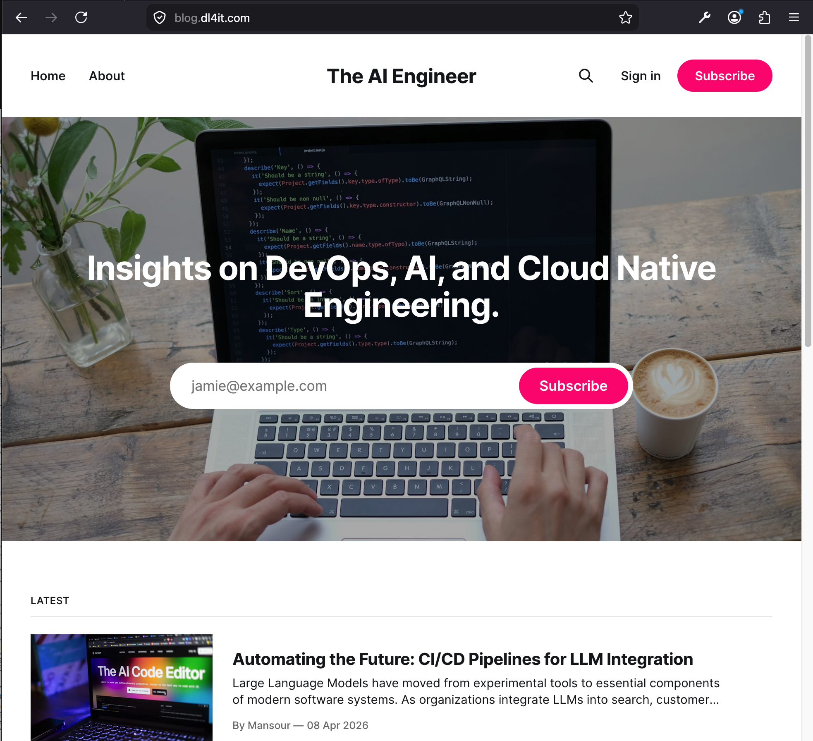
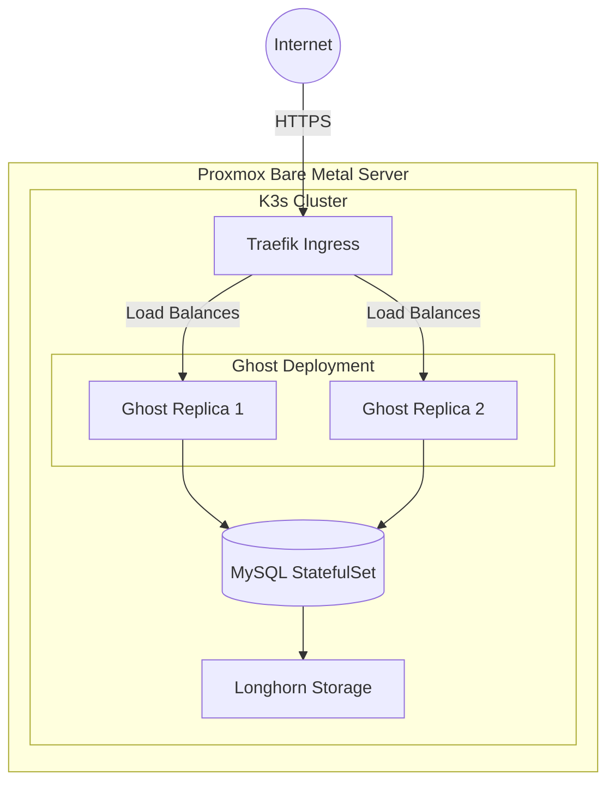
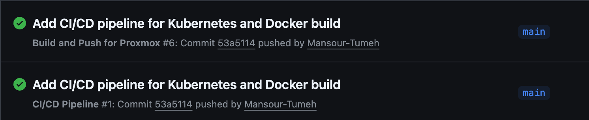

# Cloud-Native Ghost CMS Infrastructure
> **A high-availability blogging platform engineered on a 3-node bare-metal K3s cluster.**

## 📋 Requirement Mapping
This project demonstrates the evolution of a standard web service into a modern, containerized infrastructure. It fulfills all capstone requirements as follows:

| Requirement | Implementation Detail | Status |
| :--- | :--- | :--- |
| **2 Web Servers with CMS** | Ghost CMS scaled to 2 replicas for high availability. | ✅ |
| **Load Balancer** | Traefik (Production) & Nginx (Local Development). | ✅ |
| **Evolve for K8s/Cloud** | Full migration to a 3-node K3s cluster on Proxmox VMs. | ✅ |
| **Build Dockerfiles** | Custom Docker image optimized with production settings and themes. | ✅ |
| **Test Environment** | `docker-compose.yml` included for local multi-node validation. | ✅ |
| **IaC Templates** | **Terraform** (VM layer) and **K8s YAMLs** (App layer). | ✅ |
| **Production Deployment** | Securely routed via HTTPS at [blog.dl4it.com](https://blog.dl4it.com). | ✅ |

---

## 🏗️ Technical Architecture
The platform utilizes a multi-layered architecture to ensure resilience from the hardware up to the application.

### Architecture Diagram

### 1. Infrastructure Layer (IaC)
*   **Hypervisor**: Proxmox VE running on bare-metal hardware.
*   **Provisioning**: **Terraform** using the modern `bpg/proxmox` provider.
*   **Capacity**: 3 Ubuntu 22.04 VMs, each provisioned with **4GB RAM** to ensure cluster stability.
*   **Node Target**: Physical host `sd-177083`.

### 2. Orchestration & Networking
*   **Container Orchestrator**: K3s (Lightweight Kubernetes).
*   **Ingress Controller**: **Traefik** for Layer-7 routing and automated SSL termination.
*   **Load Balancer**: **MetalLB** for internal IP management within the Proxmox network.
*   **SSL/TLS**: **Cert-Manager** providing automated Let's Encrypt certificate issuance.

### 3. Storage & Database (Stateful)
*   **Distributed Storage**: **Longhorn** providing block storage and automated replication.
*   **Database**: **MySQL 8.0** deployed as a **StatefulSet** for stable identity and storage persistence.

---

## 🛠️ Development Workflow: "Shift-Left" Testing
To ensure production stability, the project utilizes a dual-environment strategy.

### Local Environment (Docker Compose)
Before deploying to the cluster, the stack is validated locally on macOS.
*   **High Availability**: Simulates production traffic distribution between two web replicas using an Nginx upstream configuration.
*   **Containerization**: Uses a custom `Dockerfile` that bakes a custom Tailwind theme into the image and bypasses email verification for lab use.

### Production Environment (Kubernetes)
Deployment is fully automated via a **self-hosted GitHub Actions runner** that:
1.  Validates Terraform manifests.
2.  Securely injects **GitHub Secrets** (Database passwords, Proxmox tokens) into the cluster.
3.  Applies declarative Kubernetes manifests for the application stack.

---

## 🚦 Troubleshooting & Resilience

### Resource Optimization
Initial deployments encountered stability issues due to memory constraints.
*   **Resolution**: Vertically scaled VM memory from 2GB to **4GB** in `variables.tf` and implemented Kubernetes **Resource Requests/Limits** to prevent OOM (Out-of-Memory) crashes.

### Storage Persistence
Managed **ReadWriteOnce (RWO)** constraints to prevent volume-mounting deadlocks.
*   **Resolution**: Migrated the database from a standard Deployment to a **StatefulSet** to ensure PVCs remain bound to the correct pod identity across restarts.

### 🔄 Disaster Recovery Strategy
Every real system must plan for failure. This platform ensures high availability and disaster recovery through the following mechanisms:
*   **Node Failure Recovery**: If one of the 3 Proxmox nodes crashes, the K3s scheduler automatically detects the node failure and reschedules the affected Pods (Ghost or MySQL) to the surviving healthy nodes.
*   **Storage Replication**: The MySQL database relies on Longhorn for block storage. Longhorn automatically replicates the persistent volume data synchronously across all 3 nodes. If a node holding the database goes offline, K3s spins up MySQL on a new node, and Longhorn seamlessly attaches the replicated storage volume to it—resulting in zero data loss.
*   **Infrastructure Rollback**: Because all infrastructure is defined via declarative Terraform code and Kubernetes manifests, recovering the entire cluster from scratch (or rolling back a bad deployment) is as simple as reverting the Git commit and running `terraform apply` or triggering the CI/CD pipeline.

---

## 📂 Repository Structure
*   **`/kubernetes`**: Declarative YAML manifests for the K3s cluster.
*   **`/my-proxmox-iac`**: Terraform files for Proxmox VM provisioning.
*   **`/nginx_config`**: Configuration for the local Nginx load balancer.
*   **`Dockerfile`**: Custom build specifications for the Ghost CMS image.
*   **`docker-compose.yml`**: Local HA testing environment.
*   **`.github/workflows`**: CI/CD pipeline logic.

---

**Author**: Mansour Tumeh  
**Live Site**: [https://blog.dl4it.com](https://blog.dl4it.com)